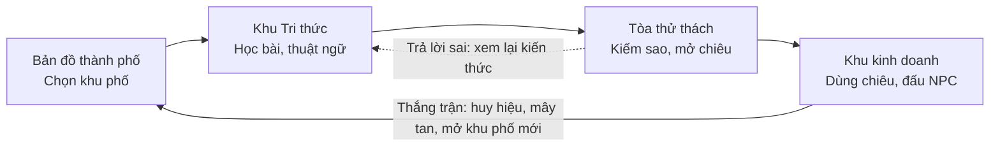

# Rescue Phong — Plan & Spec

Cập nhật: 30/09/2026 (bối cảnh thành phố, asset Kenney, quy tắc bám sát file kiến thức)

## Tổng quan

Rescue Phong là game học tập lấy bản đồ một thành phố pixel art làm màn hình chính, dựng từ hai gói asset CC0 của Kenney. Ba phần chính dùng chung một vòng chơi: học ở Khu Tri thức, luyện ở Tòa thử thách, áp dụng ở Khu kinh doanh.



Sao từ quiz mở chiêu cho trận đấu. Thắng trận được huy hiệu, mây tan và mở khu phố mới trên bản đồ. Trả lời sai thì có đường quay lại đúng thẻ kiến thức.

## Quy tắc nội dung: bám sát file kiến thức

Mọi thứ trong game phải bám sát `docs/Phần_kiến_thức_chính.md` (Chương 5, mục II và III). Phần sáng tạo được phép nhưng không được lạc khỏi nội dung file. Người chơi là sinh viên đại học đang học môn Kinh tế chính trị Mác - Lênin.

- **Kiến thức:** bài học, câu hỏi quiz, tình huống, lời giải thích và thuật ngữ chỉ trích hoặc diễn đạt lại từ file. File không có thì game không đưa vào, kể cả kiến thức đúng lấy từ nguồn khác.
- **Phần sáng tạo:** bối cảnh thành phố, cốt truyện Phong, tên NPC, tên chiêu và danh hiệu được sáng tạo, nhưng phải lấy chất liệu từ file. NPC đóng vai các chủ thể có trong file, tên chiêu gọi đúng giải pháp mà file nêu.
- **Cách diễn đạt:** dùng thuật ngữ của file. Ví dụ file viết "đầu tư trực tiếp của nước ngoài" thì game không viết "FDI".
- **Trường `source`:** mỗi câu hỏi, tình huống, thuật ngữ và NPC có trường `source` (một id hoặc danh sách id) trỏ tới mục trong file. Id sinh tự động từ tiêu đề, ví dụ `II.1.a` hay `III.1.b.su-thong-nhat-va-mau-thuan`. Bảng đầy đủ 26 id nằm ở `docs/knowledge-ids.md`.
- **Kiểm tra tự động:** `node scripts/check-content.mjs` báo lỗi khi thiếu `source` hoặc id không có trong file. Chạy trước mỗi lần build. Khi file kiến thức thay đổi, chạy thêm `--list` để in lại bảng id.
- **Kiểm tra bằng người:** script chỉ biết nội dung có trỏ đúng mục hay không. Câu chữ vẫn cần người đối chiếu với mục đó trước khi đưa vào game.
- **Không đủ nội dung:** mục nào không đủ chất liệu cho 8–10 câu hỏi thì giảm ngân hàng câu của màn đó, không thêm kiến thức ngoài.
- **Xem lại kiến thức:** nút này mở đúng mục mà `source` trỏ tới.
- **Giọng văn:** hướng tới sinh viên. Quiz dạng trắc nghiệm.

### Ghép chương, màn quiz và khu phố

Game có 2 chương theo 2 mục lớn của file. Mỗi chương là một chương quiz 10 màn và một khu phố trong Khu kinh doanh.

| Chương | Màn | Nội dung | `source` |
| --- | --- | --- | --- |
| 1. Hoàn thiện thể chế (Khu 1: Phố Thể chế) | 1 | Thể chế và thể chế kinh tế | `II.1.a` |
| 1 | 2 | Thể chế kinh tế thị trường định hướng XHCN và 3 lý do phải hoàn thiện | `II.1.b` |
| 1 | 3 | Hộp 5.2: năm hạn chế | `II.1.b` |
| 1 | 4 | Thể chế về sở hữu, nội dung một đến bốn | `II.2.a.hoan-thien-the-che-ve-so` |
| 1 | 5 | Thể chế về sở hữu, nội dung năm đến bảy | `II.2.a.hoan-thien-the-che-ve-so` |
| 1 | 6 | Thành phần kinh tế và loại hình doanh nghiệp, nội dung một đến bốn | `II.2.a.hoan-thien-the-che-phat-trien` |
| 1 | 7 | Thành phần kinh tế và loại hình doanh nghiệp, nội dung năm đến bảy | `II.2.a.hoan-thien-the-che-phat-trien` |
| 1 | 8 | Yếu tố thị trường và các loại thị trường | `II.2.b` |
| 1 | 9 | Tăng trưởng gắn với phát triển bền vững, công bằng xã hội, hội nhập quốc tế | `II.2.c` |
| 1 | 10 | Năng lực lãnh đạo của Đảng và hệ thống chính trị; ôn chương | `II.2.d` và cả mục `II` |
| 2. Quan hệ lợi ích kinh tế (Khu 2: Phố Lợi ích, nơi Phong bị kẹt) | 1 | Khái niệm lợi ích kinh tế | `III.1.a.khai-niem-loi-ich-kinh-te` |
| 2 | 2 | Bản chất và biểu hiện của lợi ích kinh tế | `III.1.a.ban-chat-va-bieu-hien-cua` |
| 2 | 3 | Vai trò của lợi ích kinh tế, Hộp 5.3 | `III.1.a.vai-tro-cua-loi-ich-kinh` |
| 2 | 4 | Khái niệm quan hệ lợi ích kinh tế | `III.1.b.khai-niem-quan-he-loi-ich` |
| 2 | 5 | Sự thống nhất và mâu thuẫn | `III.1.b.su-thong-nhat-va-mau-thuan` |
| 2 | 6 | Các nhân tố ảnh hưởng | `III.1.b.cac-nhan-to-anh-huong-den` |
| 2 | 7 | Quan hệ giữa người lao động và người sử dụng lao động | `III.1.b.mot-so-quan-he-loi-ich` |
| 2 | 8 | Quan hệ giữa những người sử dụng lao động; giữa những người lao động | `III.1.b.mot-so-quan-he-loi-ich` |
| 2 | 9 | Lợi ích cá nhân, lợi ích nhóm và lợi ích xã hội | `III.1.b.mot-so-quan-he-loi-ich` |
| 2 | 10 | Phương thức thực hiện lợi ích kinh tế; ôn chương | `III.1.b.phuong-thuc-thuc-hien-loi-ich` và cả mục `III` |

- **NPC Khu 1:** các chủ thể mà mục II nêu tên, gồm doanh nghiệp thuộc các thành phần kinh tế, doanh nghiệp nhà nước, hợp tác xã và nông dân, đại diện dự án đầu tư trực tiếp của nước ngoài.
- **NPC Khu 2:** các chủ thể mà mục III nêu tên, gồm người lao động, người sử dụng lao động, Công đoàn, nghiệp đoàn và hội nghề nghiệp, nhóm lợi ích.

## Bản đồ trung tâm

Màn hình đầu tiên là bản đồ một thành phố pixel art, thay cho sidebar. Người chơi vào từng tính năng theo hai cách: đi bằng WASD tới cửa tòa nhà, hoặc click thẳng vào tòa nhà.

| Khu phố / tòa nhà | Tính năng | Mở khi |
| --- | --- | --- |
| Khu Tri thức | Thư viện, Đài quan sát, Nhà lưu trữ | Mở sẵn từ đầu, nằm cạnh chỗ nhân vật xuất hiện |
| Tòa thử thách | Quiz theo màn | Mở sẵn |
| Khu kinh doanh | Overworld và trận đấu: đường phố, cửa hàng, văn phòng | Khu 1 mở sẵn, các khu sau cần huy hiệu |
| Hồ sơ | Nhân vật, trang phục | Mở sẵn |
| Huy hiệu | Thành tích | Mở sẵn |
| Bảng xếp hạng | Điểm của người chơi | Mở sẵn |
| Cài đặt | Âm thanh, điều khiển | Mở sẵn |

- **Asset:** đường, vạch kẻ, bãi đỗ xe và tòa nhà lấy từ Roguelike Modern City. Nhân vật lấy từ RPG Urban Pack. Không trộn mặt đường của hai gói vì bảng màu lệch nhau. Cả hai là gói CC0 của Kenney.
- **Khu khóa:** khu phố chưa mở bị mây che, kèm nhãn điều kiện, ví dụ "Cần 3 huy hiệu". Khi mở khu thì mây tan. Sprite mây tự vẽ theo bảng màu của Kenney và dùng chung với hiệu ứng chuyển cảnh.
- **Hover:** rê chuột vào thì tòa nhà nảy nhẹ và hiện tên. Tên tòa nhà là nhãn tiếng Việt do game vẽ, không phụ thuộc vào tile.
- **Cốt truyện:** Phong bị kẹt ở khu phố xa nhất của thành phố. Mỗi khu mở ra là thêm một bước tới việc giải cứu Phong.
- **Bản quyền:** ảnh tham khảo (Blooket) chỉ dùng để lấy ý tưởng bố cục. Hình ảnh dùng asset CC0 của Kenney, phần còn thiếu thì tự vẽ.
- **Thứ tự làm:** bản đầu chỉ cần click. Phần nhân vật đi trên bản đồ làm sau, ở giai đoạn Kết nối.

## Khu Tri thức

Phần kiến thức gồm ba công trình và luôn mở, ai muốn tra lúc nào cũng được. Mỗi chương kiến thức ứng với một chương quiz và một vùng mô phỏng.

### Thư viện: bài học

- **Nguồn:** `Phần_kiến_thức_chính.md` là nguồn duy nhất. Script tách file này thành `data/knowledge/chXX/baiYY.md`, mỗi file có id, chương và danh sách thuật ngữ liên quan. Sửa nội dung thì sửa file gốc rồi chạy lại script.
- **Quy tắc chia:** `##` là chương, `###` là bài. Mỗi bài chia thành các thẻ kiến thức 150–250 chữ, đọc trong 1–2 phút.
- **Tiến độ:** mỗi thẻ có đánh dấu "đã học", mỗi chương có thanh tiến độ.

### Đài quan sát: sơ đồ tư duy

- **Công cụ:** markmap vẽ sơ đồ trực tiếp từ các tiêu đề markdown, không phải nhập tay lần hai.
- **Thao tác:** phóng to, kéo, thu gọn hoặc mở từng nhánh. Bấm vào một nút là mở đúng thẻ kiến thức đó.
- **Tiến độ:** nút đã học thì sáng, chưa học thì mờ.
- **Về sau:** nếu muốn sơ đồ mang phong cách pixel, chuyển sang React Flow để tự vẽ nút.

### Nhà lưu trữ: thuật ngữ

- **Dữ liệu:** mỗi thuật ngữ gồm tên, định nghĩa, ví dụ, hình minh họa nếu có, và link về bài học. Lưu trong `data/terms.json`.
- **Sưu tầm kiểu Pokédex:** gặp một thuật ngữ trong bài học, quiz hay trận đấu thì nó được ghi vào sổ. Sưu tầm đủ một chương thì được huy hiệu. Thuật ngữ chưa sưu tầm vẫn đọc được.
- **Tìm kiếm:** hỗ trợ gõ không dấu, dùng Fuse.js kết hợp chuẩn hóa bỏ dấu.
- **Tooltip:** thuật ngữ xuất hiện ở bất kỳ đâu đều được gạch chân. Rê chuột vào là hiện định nghĩa ngắn.

### Liên kết với quiz và mô phỏng

Khi trả lời sai trong quiz, hoặc chọn phải "Phản tác dụng" trong trận, phần giải thích có nút "Xem lại kiến thức". Nút này mở đúng thẻ kiến thức liên quan.

## Mô phỏng

Mô phỏng là một RPG pixel kiểu Pokémon Revolution Online, đặt trong Khu kinh doanh của thành phố. Người chơi đi bằng WASD qua đường phố, cửa hàng và văn phòng, bị NPC chặn, rồi "đánh" bằng cách chọn cách xử lý tình huống.

### Overworld

- **Bối cảnh:** mỗi vùng là một khu phố dựng từ tile Kenney: đường, bãi đỗ xe, tòa nhà từ Roguelike Modern City, xe cộ cũng từ gói này; nhân vật từ RPG Urban Pack.
- **Di chuyển:** đi theo từng ô bằng plugin grid-engine. Map vẽ bằng Tiled, va chạm lấy từ lớp collision.
- **Nhân vật:** RPG Urban Pack có 6 nhân vật đi 4 hướng, có animation. Để có thêm NPC (nhân viên, khách hàng, sếp…), tô lại màu tóc và quần áo từ 6 nhân vật gốc.
- **Gặp NPC:** NPC có tầm nhìn. Người chơi đi vào tầm nhìn thì NPC hiện dấu "!", đi tới bắt chuyện, rồi chuyển cảnh vào trận.
- **Mobile:** có D-pad ảo cho điện thoại và tablet. Điện thoại bắt buộc xoay ngang: khi cầm dọc, game tạm dừng và hiện lớp phủ nhắc xoay màn hình. Android có thêm nút toàn màn hình để khóa hướng ngang; iOS không cho khóa nên chỉ dùng lớp phủ.
- **Phạm vi:** bắt đầu với một khu phố nhỏ và ít NPC. Làm chắc hệ thống trận đấu trước rồi mới mở rộng.

### Trận đấu

- **Hai thanh chỉ số:** Mức nguy hiểm của tình huống, về 0 là thắng. Bình tĩnh của người chơi, về 0 là thua.
- **Mỗi lượt:** hiện mô tả tình huống và tối đa 4 lựa chọn, giống bảng 4 chiêu của Pokémon.
- **Ba mức kết quả:**
    - "Hiệu quả cao!": xử lý đúng, nguy hiểm giảm mạnh.
    - "Chưa đủ": đúng một phần.
    - "Phản tác dụng!": xử lý sai, tình huống leo thang và người chơi mất bình tĩnh.
- **Giải thích:** mỗi lựa chọn có một câu giải thích ngắn vì sao đúng hay sai. Hiện lúc nào là tuỳ độ khó.
- **Rẽ nhánh:** chọn sai thì lượt sau khó hơn, chọn đúng thì sang giai đoạn tiếp.
- **Loại đối thủ:** NPC thường là tình huống ngắn 2–3 lượt. Mỗi vùng có một "trùm" như gym leader, với tình huống dài nhiều giai đoạn. Thắng trùm được huy hiệu.
- **Chiêu:** sao kiếm được từ quiz mở khóa chiêu (cách xử lý) dùng trong trận.

### Dữ liệu tình huống

Tình huống viết thành file JSON thay vì viết cứng trong code, để người soạn nội dung tự thêm được. Ví dụ dưới đây lấy từ Hộp 5.2 (việc tiếp cận nguồn lực chưa bình đẳng) và nội dung "Một là", "Hai là" của mục hoàn thiện thể chế phát triển các thành phần kinh tế:

```json
{
  "id": "dn_binh_dang_01", "source": ["II.1.b", "II.2.a.hoan-thien-the-che-phat-trien"], "danger": 100,
  "turns": [{
    "prompt": "Doanh nghiệp tôi tiếp cận nguồn lực khó hơn doanh nghiệp khác. Thể chế cần hoàn thiện theo hướng nào?",
    "options": [
      { "text": "Thực hiện nhất quán một chế độ pháp lý kinh doanh, không phân biệt hình thức sở hữu và thành phần kinh tế", "result": "super", "danger": -60, "explain": "Mọi doanh nghiệp hoạt động theo cơ chế thị trường, bình đẳng và cạnh tranh lành mạnh theo pháp luật" },
      { "text": "Hoàn thiện pháp luật về đầu tư, kinh doanh, bảo đảm quyền tự do kinh doanh", "result": "ok", "danger": -20, "explain": "Đây là nội dung thứ hai; nội dung thứ nhất mới nói trực tiếp về việc không phân biệt hình thức sở hữu" },
      { "text": "Dành ưu đãi riêng cho doanh nghiệp thuộc một thành phần kinh tế", "result": "backfire", "danger": 30, "calm": -25, "explain": "Trái với yêu cầu không phân biệt hình thức sở hữu và thành phần kinh tế" }
    ]
  }]
}
```

## Độ khó mô phỏng

Mỗi trận có ba mức: Tập sự, Cứu hộ viên và Chuyên gia. Mức Chuyên gia của một trận chỉ mở sau khi thắng mức Cứu hộ viên của trận đó.

| Yếu tố | Tập sự | Cứu hộ viên | Chuyên gia |
| --- | --- | --- | --- |
| Số lựa chọn | 3 | 4 | 4, đáp án nhiễu sát hơn |
| Thời gian mỗi lượt | Không giới hạn | 30 giây | 15 giây |
| Gợi ý (loại bớt 1 đáp án sai) | 2 lần | 1 lần | Không có |
| Khi chọn sai | Mất ít bình tĩnh (×0,5) | Mất vừa (×1) | Mất nhiều (×1,5), leo thang nhanh |
| Giải thích | Sau mỗi lượt | Sau mỗi lượt | Tổng kết cuối trận |
| Biến cố bất ngờ | Không | Thỉnh thoảng | Có |
| Phần thưởng | Huy chương đồng | Huy chương bạc | Huy chương vàng |

- **Huy chương:** mỗi NPC có huy chương riêng theo từng mức, giống cách Angry Birds dùng sao, nên người chơi có lý do quay lại đánh lại.
- **Hạ độ khó:** thua 2 lần liên tiếp thì game gợi ý hạ độ khó. Game chỉ gợi ý, không tự hạ.
- **Cách cài đặt:** không viết ba bản cho mỗi tình huống. Dùng một file tình huống, cộng với một file cấu hình `data/difficulty.json`. Mỗi lựa chọn hoặc biến cố trong file tình huống có thêm trường `minLevel`, ví dụ một đáp án nhiễu tinh vi chỉ hiện ở mức Chuyên gia. Engine trận đấu đọc cả hai file và tự lọc nội dung theo mức đang chơi.

```json
{
  "tapsu":     { "options": 3, "timer": 0,  "hints": 2, "wrongMult": 0.5, "explain": "turn", "events": false },
  "cuuhovien": { "options": 4, "timer": 30, "hints": 1, "wrongMult": 1,   "explain": "turn", "events": true },
  "chuyengia": { "options": 4, "timer": 15, "hints": 0, "wrongMult": 1.5, "explain": "end",  "events": true }
}
```

## Quiz theo màn

Quiz chia thành từng màn kiểu Angry Birds. Mỗi màn có 5 câu và chấm 0–3 sao theo số câu đúng.

| Số câu đúng | Kết quả |
| --- | --- |
| 5/5 | 3 sao |
| 4/5 | 2 sao |
| 3/5 | 1 sao |
| Dưới 3 | Chưa qua màn |

- **Màn hình chọn màn:** một con đường với các nút số. Mỗi nút hiện 0–3 sao, hoặc ổ khóa nếu chưa mở.
- **Lưu kết quả:** game lưu số sao cao nhất từng đạt ở mỗi màn.
- **Mở khóa:** được 1 sao là mở màn kế tiếp. Chương mới cần đủ tổng sao, ví dụ 20 sao mới mở chương 2.
- **Ngân hàng câu hỏi:** mỗi màn có 8–10 câu, mỗi lần chơi bốc ngẫu nhiên 5 câu, để chơi lại không thành học thuộc đáp án.
- **Thời gian:** không ảnh hưởng số sao, vì sao là thước đo kiến thức. Thời gian chỉ cộng điểm thưởng cho bảng xếp hạng.
- **Liên kết:** sao mở khóa chiêu mới trong mô phỏng. Trả lời sai thì có nút "Xem lại kiến thức".

## Hiệu ứng chuyển cảnh

Mọi lần chuyển cảnh đều dùng một hiệu ứng: mây chụm lại che kín màn hình, rồi tản ra để lộ cảnh mới.

1. **Chụm lại (khoảng 500–600ms):** mây bay từ bốn phía và các góc vào giữa, tăng tốc dần (ease-in).
2. **Giữ:** mây che kín màn hình và hiện tên khu vực sắp vào. Đổi cảnh và tải asset diễn ra ở pha này. Pha giữ kéo dài tối thiểu 300ms; nếu cảnh mới tải lâu hơn thì chờ tải xong mới mở.
3. **Tản ra (khoảng 500–600ms):** mây bay ngược ra ngoài, chậm dần lúc kết thúc (ease-out).

- **Chữ ký của game:** dùng chung sprite với lớp mây che vùng khóa trên bản đồ trung tâm.
- **Khóa thao tác:** chặn WASD và click trong suốt quá trình chuyển, không cho kích hoạt chuyển cảnh lần hai khi đang chuyển.
- **Kiểu chuyển động:** mượt, hoặc giật bước kiểu pixel (`steps(8)`). Đã chốt: mượt.
- **Giảm chuyển động:** khi hệ điều hành bật prefers-reduced-motion, mây chỉ hiện dần tại chỗ, không bay.
- **Âm thanh:** một tiếng "vút" nhẹ lúc mây chụm lại.
- **Biến thể vào trận:** mây xám đậm hơn và nhanh hơn (khoảng 300ms). Các lần chuyển cảnh còn lại dùng mây trắng.

### Cài đặt

Hiệu ứng là một lớp overlay React nằm trên cùng, phủ lên cả canvas Phaser. Mọi lần chuyển cảnh đi qua đúng một hàm. Phía Phaser không gọi `scene.start()` trực tiếp mà gửi yêu cầu qua EventBus.

```ts
export async function transitionTo(go: () => Promise<void>, label?: string) {
  if (clouds.busy) return;          // chặn bấm 2 lần
  input.lock();
  await clouds.close(label);        // mây chụm lại, hiện tên khu vực
  await Promise.all([go(), wait(300)]); // đổi cảnh + tải asset, giữ tối thiểu 300ms
  await clouds.open();              // mây tản ra
  input.unlock();
}
```

## Công nghệ và cấu trúc thư mục

Stack đề xuất là Vite + TypeScript, với React cho giao diện và Phaser cho phần game. Repo [BaryuH/Rescue_Phong](https://github.com/BaryuH/Rescue_Phong) hiện mới có README và LICENSE, nên chưa có gì ràng buộc.

| Phần | Công cụ |
| --- | --- |
| Giao diện (quiz, hội thoại, menu, bảng chọn chiêu, kiến thức) | React |
| Game (bản đồ trung tâm, overworld, hiệu ứng trận) | Phaser, theo template `phaserjs/template-react-ts` có sẵn EventBus |
| Map và di chuyển | Tiled, plugin grid-engine |
| Sơ đồ tư duy | markmap, sau này có thể chuyển React Flow |
| Tìm thuật ngữ | Fuse.js và chuẩn hóa bỏ dấu |
| Lưu tiến độ | localStorage trước, sau này thêm Supabase hoặc Firebase nếu cần tài khoản |
| Asset pixel | Kenney Roguelike Modern City (bản đồ) và RPG Urban Pack (nhân vật), đều 16×16, giấy phép CC0 nên commit thẳng lên repo public được. Nâng cấp tùy chọn: bộ Modern của LimeZu (trả phí, cần repo private hoặc không commit file asset) |

```
src/
  game/scenes/    HubScene, OverworldScene, BattleScene
  ui/             QuizLevelMap, QuizPlay, BattleMenu, Dialogue, CloudTransition
  ui/knowledge/   LessonReader, MindMap, Glossary
  systems/        progress (sao, huy hiệu), save, battleEngine, transition
  data/           quiz/*.json, scenarios/*.json, npcs.json, terms.json, difficulty.json
  data/knowledge/ chXX/baiYY.md (sinh từ Phần_kiến_thức_chính.md)
scripts/          check-content.mjs (quy tắc nội dung), split-knowledge (tách file kiến thức)
docs/             plan-and-spec.md, Phần_kiến_thức_chính.md, knowledge-ids.md, tile-catalog.md, tiles/
public/assets/    kenney/rpg-urban, kenney/modern-city, clouds, maps (Tiled), audio
```

## Kế hoạch thực hiện

Dự án chia thành 9 giai đoạn, tổng khoảng 12–15 tuần cho 1–2 người. Hết giai đoạn 4 đã có bản chơi được để demo. Hết giai đoạn 6 có một lát cắt dọc đủ các phần: bản đồ trung tâm, chương 1 kiến thức, 3 màn quiz, 1 map, 2 trận đấu.

| Giai đoạn | Thời lượng | Việc chính | Xong khi | Trạng thái |
| --- | --- | --- | --- | --- |
| 0. Thiết kế | 1 tuần | Chốt chủ đề; soạn nội dung chương 1 (10 màn quiz, 5–6 tình huống); chia file kiến thức, trích thuật ngữ; ghép chương kiến thức với chương quiz và vùng mô phỏng; phác bản đồ thành phố; lập bảng tra tile Kenney (đường, tòa nhà, xe, nhân vật), kiểm tra cỡ tile và độ khớp giữa hai gói | Có tài liệu nội dung và phác thảo map | Hoàn thành |
| 1. Nền móng | 1 tuần | Setup Vite, React, Phaser; store tiến độ và lưu localStorage; chốt định dạng JSON; hệ thống chuyển cảnh mây bản tạm và khóa thao tác | Chuyển qua lại giữa các cảnh trống bằng hiệu ứng mây | Hoàn thành |
| 2. Bản đồ trung tâm | 1 tuần | Bản đồ thành phố dựng từ tile Kenney: click được, hover, khu phố khóa có mây che | Vào được từng tính năng từ bản đồ | Hoàn thành |
| 3. Khu Tri thức | 1–2 tuần | Script tách markdown, trình đọc bài, sơ đồ tư duy markmap, sổ thuật ngữ tìm không dấu, tooltip | Đọc được chương 1 và tra được thuật ngữ | Chưa bắt đầu |
| 4. Quiz | 1–2 tuần | Màn hình chọn màn, chơi 5 câu, chấm sao, mở khóa, màn kết quả, nút xem lại kiến thức | Chơi hết chương 1 và sao được lưu | Chưa bắt đầu |
| 5. Overworld | 2 tuần | Khu phố đầu tiên dựng bằng Tiled từ tile Kenney, đi bằng WASD theo ô, va chạm, NPC tô lại màu từ 6 nhân vật gốc, hội thoại, dấu "!" | Đi lại, nói chuyện, bị NPC chặn đánh | Chưa bắt đầu |
| 6. Trận đấu | 2 tuần + 3–4 ngày | BattleScene, hai thanh, lựa chọn đọc từ JSON, giải thích, thắng/thua; cấu hình độ khó, đồng hồ, gợi ý, biến cố, huy chương | Đánh trọn một trận ở cả ba mức | Chưa bắt đầu |
| 7. Kết nối | 1 tuần | Sao mở chiêu, huy hiệu, mây tan, thành tích; nhân vật đi trên bản đồ trung tâm; xem lại kiến thức, ghi thuật ngữ vào sổ, sơ đồ sáng theo tiến độ | Vòng chơi khép kín | Chưa bắt đầu |
| 8. Hoàn thiện | 1–2 tuần | Âm thanh, sprite mây hoàn chỉnh, mây xám khi vào trận, D-pad cho mobile, thêm nội dung, cho người thật chơi thử | Có bản demo hoàn chỉnh | Chưa bắt đầu |

Quiz làm trước overworld vì dễ hơn, lại dựng sẵn hệ thống sao và tiến độ mà mô phỏng dùng lại. Nếu làm nhóm, người soạn nội dung có thể làm song song từ giai đoạn 0.

Sau bản demo mới làm trợ lý AI. Trợ lý chỉ được trả lời dựa trên file kiến thức và phải từ chối câu hỏi ngoài phạm vi. Trợ lý cần API key và một hàm chạy phía server, nên sẽ có kế hoạch riêng.

## Việc còn mở

Các mục dưới đây cần chốt trước hoặc trong giai đoạn 0.

- [x] Tải RPG Urban Pack và Roguelike Modern City (đã có trong `assets/packs/`)
- [x] Kiểm tra cỡ tile và độ khớp: cả hai gói đều 16×16; bản đồ dùng Roguelike Modern City, nhân vật lấy từ RPG Urban Pack
- [x] Quyết định nâng cấp asset: Không nâng cấp lên bộ Modern của LimeZu; giữ nguyên 2 gói asset CC0 của Kenney (Roguelike Modern City cho bản đồ, RPG Urban Pack cho nhân vật) để public repo và tối ưu tải nhẹ
- [x] Gửi `Phần_kiến_thức_chính.md` (đã có trong `docs/`)
- [x] Sinh bảng id cho 26 mục của file kiến thức và ghép mục với chương, màn quiz, khu phố
- [x] Chia file kiến thức thành thẻ và trích thuật ngữ (33 thẻ tri thức trong `src/data/knowledge/`, 83 thuật ngữ trong `src/data/terms.json`)
- [x] Soạn nội dung chương 1: ngân hàng câu hỏi 10 màn (80 câu trong `src/data/quiz/chuong-1.json`) và 6 tình huống mô phỏng rẽ nhánh (`src/data/scenarios/chuong-1.json`)
- [x] Chốt chủ đề và người chơi: Chương 5 (mục II và III) theo file kiến thức; sinh viên học môn Kinh tế chính trị Mác - Lênin
- [x] Chốt nền tảng: máy tính; điện thoại bắt buộc xoay ngang
- [x] Chọn kiểu chuyển động mây: mượt
- [x] Thống nhất tài liệu: plan này là chuẩn; bỏ `ideas.md`, sửa `README.md` và `tech_stack.md` theo plan
- [x] Chốt nơi triển khai: Vercel gói miễn phí (Hobby Free tier), tự động deploy qua CI/CD từ nhánh main của GitHub
- [x] Chốt số sao cần để mở chương 2 và số huy hiệu cần để mở Khu 2: Cần **20/30 sao** Chương 1 để mở Chương 2 (đảm bảo sinh viên nắm vững tối thiểu ~70% kiến thức); Cần **3 Huy hiệu Thể chế** Khu 1 để mở khóa cổng Khu 2 (giải cứu Phong)
